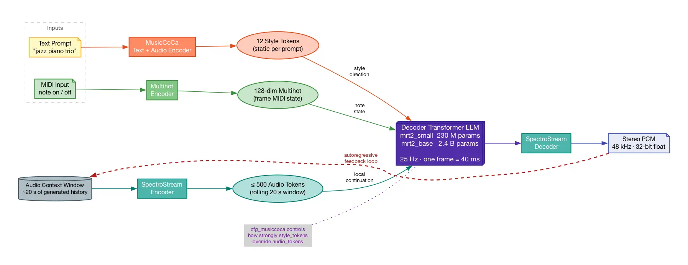

# MRT2: Prompts, Drift, and How to Fight It

## Architecture



Three conditioning signals feed the Decoder Transformer on every 40 ms frame:

| Signal | Source | Size | Character |
| :--- | :--- | :--- | :--- |
| Style tokens | MusicCoCa (text/audio encoder) | 12 tokens | **Static** — same every frame |
| Audio tokens | SpectroStream encoder of last ~20 s | ≤ 500 tokens | **Dynamic** — changes every frame |
| MIDI state | 128-dim multihot (notes held this frame) | 128 floats | **Dynamic** |

## Why Prompts Drift

The drift is the audio context window taking over.

**At first** — the context is empty/silent. The 12 MusicCoCa style tokens
dominate. The model generates music strongly shaped by your prompt.

**After ~10–20 seconds** — the context fills with the model's own generated
audio. Now the transformer is solving: *"given these ~500 tokens of music I
just made, what comes next, in the style of `jazz piano trio`?"* The audio
context is a much stronger **local** signal than the 12 static style tokens.
The model follows its own musical momentum — the key it wandered into, the
rhythmic pattern it established — and the original prompt intent becomes a
softer constraint.

This is not a bug. It is the fundamental tradeoff of autoregressive generation
with a long context window. The model does continuous music by treating itself
as the continuation of what it just made.

## The Levers

### Encourage drift

| Control | API call | Effect |
| :--- | :--- | :--- |
| Let it run | — | Audio context dominates; model evolves freely |
| Low `cfg_musiccoca` | `set_cfg_musiccoca(1.0)` | Weak style guidance; model follows its own logic |

### Fight drift (rein back in)

| Control | API call | Effect |
| :--- | :--- | :--- |
| **Reset context** | `trigger_reset()` | Clears the audio context; starts fresh from the prompt |
| **High `cfg_musiccoca`** | `set_cfg_musiccoca(5.0–8.0)` | Stronger prompt adherence; overrides audio momentum |
| **CFG notes** | `set_cfg_notes(v)` | Weights melodic note conditioning |
| **CFG drums** | `set_cfg_drums(v)` | Weights rhythmic/drum conditioning |
| **Audio prefill** | `prefill_state(samples, ...)` | Loads reference audio as context; model "inherits" that style |
| **MIDI gate** | `set_midi_gate_enabled(true)` | Attenuates output when no notes held; rhythmic gating |

### Steer in real time

| Control | API call | Effect |
| :--- | :--- | :--- |
| **Change prompt** | `set_text_prompt(text)` | Live restyle; takes effect next inference step |
| **Blend weights** | `set_blend_weight(i, w)` | Mix up to 6 MusicCoCa embeddings; shift style continuously |

## `cfg_musiccoca` in Detail

Classifier-free guidance (CFG) is the primary dial between *"follow the
prompt"* and *"follow the audio context"*.

At inference time the transformer runs twice per frame: once conditioned on
the MusicCoCa embedding, and once without it (null conditioning). The output
is then:

```
output = null_output + cfg_weight × (conditioned_output − null_output)
```

| `cfg_musiccoca` | Behaviour |
| ---: | :--- |
| 1.0 | No guidance — equivalent to ignoring the prompt |
| 3.0 | Default — light style direction, model has creative freedom |
| 5.0–6.0 | Strong prompt adherence; noticeable drift reduction |
| 8.0+ | Very strong; can cause repetitive or "over-corrected" output |

## `trigger_reset()` as a Creative Tool

`trigger_reset()` clears the audio context mid-playback **without stopping the
inference thread**. The model immediately re-anchors to the current prompt.
The reset envelope fades in over one frame (~40 ms) to avoid an audible click.

**Proven effective pattern** (confirmed in Swift player):

```
1. Edit the text prompt
2. call trigger_reset()          ← immediate; no stop/start needed
3. generation re-anchors to new prompt within 1–2 frames (~80 ms)
```

The prompt change propagates in ≤40 ms (next inference frame) because
`set_text_prompt` is an **atomic write** read by the inference thread on its
very next tick — it is not polled or debounced. You can call it on every
keystroke safely.

## Audio Prefill

`prefill_state(float* samples, int num_samples, ...)` loads PCM audio into the
context window and checkpoints it. The model inherits the audio's character and
is far less likely to drift from it.

**Prefill vs save_state — which to use:**

| Goal | Use |
| :--- | :--- |
| "Continue from this exact musical moment" | `save_state` + `load_state` |
| "Start fresh but influenced by this audio" | `prefill_state(recorded_audio)` |
| "Completely clean cold start" | `prefill_silence(550)` |

After a successful prefill, `trigger_reset()` returns to the prefilled context
— **not** to silence — until `reset_to_factory()` explicitly clears it.

`prefill_silence(550)` (550 frames ≈ 22 s) fills the context with cached silent
tokens. This is the cleanest possible cold start: the attention window is fully
saturated so no prior generation bleeds into output, but there is no audio
anchor. Use it when you want maximum prompt adherence with no audio bias.

## CFG Parameters Are Live (Atomic)

All three CFG weights can be changed mid-playback with immediate effect:

```cpp
set_cfg_musiccoca(v)   // prompt adherence vs audio context momentum
set_cfg_notes(v)       // melodic note conditioning weight
set_cfg_drums(v)       // rhythmic/drum conditioning weight
```

These are atomic stores — the inference thread reads the new value on its
very next frame. You can wire them to sliders that update continuously
without any stop/restart.

## `reset_to_factory()` — The Escape Hatch

`reset_to_factory()` undoes any checkpoint from `prefill_state`,
`prefill_silence`, or `load_state`, restoring the model's original weights
to their factory-initial state. Use this when you want to clear all session
history and have the next `trigger_reset()` return to silence rather than
a prior prefill.

```
load_state("bookmark_1")  →  trigger_reset() returns to bookmark_1
reset_to_factory()         →  trigger_reset() now returns to silence
```

## Recommended Defaults for Player UI

```
cfg_musiccoca : 3.0   (default — good balance between prompt and drift)
cfg_notes     : 1.0
cfg_drums     : 1.0
buffersize    : 8192  (max ring buffer — eliminates scheduling-jitter underruns)
```

Expose `cfg_musiccoca` as a slider (1–8) labelled **"Prompt Strength"**.
A **"Reset"** button mid-playback (calls `trigger_reset()` without stopping)
is the single most useful creative control after the text prompt itself.

The most important UX distinction to surface clearly to users:
- **Pause** (`set_bypass(true)`) → context preserved, seamless resume
- **Stop** → inference halted, next Play clears context via `trigger_reset()`
- **Reset** → context cleared mid-play, prompt re-anchored, no audio gap
